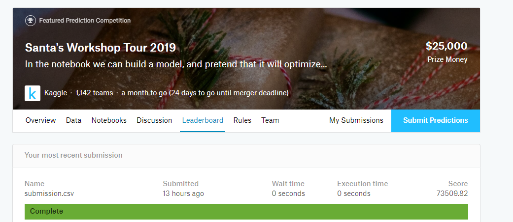

# DataScience-2019-PUSK
This repository was created for final project at Data Science course by Alexander Duymin in MEPhI 2019 (7th term). Contributors are: [Панфилов Иван (Panfilov Ivan)](https://github.com/vanyapanf), [Усман Дмитрий(Usman Dmitri)](https://github.com/DimaUsman), [Смирнов Александр(Smirnov Alexander)](https://github.com/Sashasmir0511), [Кутузов Артём(Kutuzov Artem)](https://github.com/ArtemCoolAc) (PUSK)

## Table Of Contents
- [Project](#project)
- [Overview](#overview)
- [Result](#result)
- [Code Description](#code-description)
- [Competition Complete](#competition-completion)

## Project
For final project at Data Science course has been chosen  [Santa's Workshop Tour 2019](https://www.kaggle.com/c/santa-workshop-tour-2019/) from different active competition at Kaggle.com .


### Overview
We were provided by Kaggle with overview information about our project:
 - [Dataset Description](./DataDescriptionKaggle.md);
 - [Project Description](./DescriptionKaggle.md);
 - [Evaluation](./EvaluationKaggle.md);
 - [Datasets](./santa-workshop-tour-2019):
   - [Testing Data](./santa-workshop-tour-2019/family_data.csv);
   - [Sample Submission From Kaggle](./santa-workshop-tour-2019/sample_submission.csv);
####    Example Of Testing Data
  | family_id | choice_0 | choice_1 | choice_2 | choice_3 | choice_4 | choice_5 | choice_6 | choice_7 | choice_8 | choice_9 | n_people |
  | :---: | :---: | :---: | :---: | :---: | :---: | :---: | :---: | :---: | :---: | :---: | :---: |
  | 0 | 52 | 38 | 12 | 82 | 33 | 75 | 64 | 76 | 10 | 28 | 4 |
  | 1 | 26 | 4 | 82 | 5 | 11 | 47 | 38 | 6 | 66 | 61 | 4 |
  | 2 | 100 | 54 | 25 | 12 | 27 | 82 | 10 | 89 | 80 | 33 | 3 |
  | 3 | 2 | 95 | 1 | 96 | 32 | 6 | 40 | 31 | 9 | 59 | 2 |
  | 4 | 53 | 1 | 47 | 93 | 26 | 3 | 46 | 16 | 42 | 39 | 4 |
  | 5 | 32 | 59 | 12 | 3 | 60 | 26 | 35 | 50 | 5 | 2 | 4 |
  | 6 | 88 | 4 | 1 | 3 | 91 | 32 | 39 | 57 | 28 | 99 | 2 |
   
  ####    Example of Submission
| family_id | assigned_day |
| :---: | :---: |
| 0 | 100 |
| 1 | 99 |
| 2 | 98 |
| 3 | 97 |
| 4 | 96 |
| 5 | 95 |
| 6 | 94 |
| 7 | 93 |
| 8 | 92 |
| 9 | 91 |
| 10 | 90 |

### Result
- [Submission](./submission_73509.csv)
- [Code](./santa_competition.py)

### Code Description
For this task was used external library base on [Linear Optimization](https://developers.google.com/optimization/lp/lp).
In nutshell, this library allows finding the most suitable values of parameters based on their linear constraints.

#### Example
**Maximize 3x + 4y subject to the following constraints:**

| Restriction |
| :---: |
| x + 2y	≤	14 |
| 3x – y	≥	0 |
| x – y	≤	2 | 

Based on this constraints can be made the next graphs.


And in this figure, that was formed from crossing lines, is our solution.

#### Implementation
Our objective to minimaze the overall cost.
**cost=preference_cost+accounting_penalty :**
where:
 - preference_cost is linear function, which depends on quantity of consolation gifts;
 - acounting_penalty is non linear fuction:
 
 
 
To make from cost linear function, we need:
 
 
 
In that case cost~preference_cost. So now we can use Linear Optimization.

#### Detailed Description
- Get value of penalty based on choice and quantity of family members.
``` python
def get_penalty(n, choice):
    penalty = None
    if choice == 0:
        penalty = 0
    elif choice == 1:
        penalty = 50
    elif choice == 2:
        penalty = 50 + 9 * n
    elif choice == 3:
        penalty = 100 + 9 * n
    elif choice == 4:
        penalty = 200 + 9 * n
    elif choice == 5:
        penalty = 200 + 18 * n
    elif choice == 6:
        penalty = 300 + 18 * n
    elif choice == 7:
        penalty = 300 + 36 * n
    elif choice == 8:
        penalty = 400 + 36 * n
    elif choice == 9:
        penalty = 500 + 36 * n + 199 * n
    else:
        penalty = 500 + 36 * n + 398 * n
    return penalty
```
-  Create Matrix of for all familes and all their possible choices.
``` python
def GetPreferenceCostMatrix(data):
    cost_matrix = np.zeros((N_FAMILIES, N_DAYS), dtype=np.int64)
    for i in range(N_FAMILIES):
        desired = data.values[i, :-1]
        cost_matrix[i, :] = get_penalty(FAMILY_SIZE[i], 10)
        for j, day in enumerate(desired):
            cost_matrix[i, day-1] = get_penalty(FAMILY_SIZE[i], j)
    return cost_matrix
```
- Find possible day for familes.
``` python
def solveSantaLP(ni_,nj_):
```
  - Initialization of value that we research. For value we choose attendence for each family in their desired day. 1 - if they go, 0 - if not. 
  ``` python
   for i in range(N_FAMILIES):
        for j in DESIRED[i, :]:
            candidates[j].append(i)
            x[i, j] = S.BoolVar('x[%i,%i]' % (i, j))
  ```
  - **Quantity of family for each choice** 
   ``` python
    qq=[S.Sum([x[i, DESIRED[i,j]] for i in range(N_FAMILIES)])
                       for j in range(10)]
   ```
  - **Accouting Penalty exponentially dependent of difference between attendece in close days. So to minimaze AP, we need decrease dif. And to that we need linear constraints (ni_=25 has been choosen by brute force, it can be explainded by some calculation** : 
  
  
   ``` python
    for j in range(N_DAYS - 1):
        S.Add(daily_occupancy[j] - daily_occupancy[j + 1] <= ni_)
        S.Add(daily_occupancy[j + 1] - daily_occupancy[j] <= ni_)
   ```
  - **The more quantity of holes in schedule, the more Accouting Penalty. So to decrease the quantity of holes the first day, and the last should be working days:**
  ``` python
       S.Add(daily_occupancy[0]>=1)
       S.Add(daily_occupancy[-1]>=1)
  ```
  - **First choices is more desirable than the last choices. So quantity of first group should be more then quantity of second group:**
  ``` python
        S.Add(qq[0]+qq[1]+qq[2]+qq[2]+qq[3]>=1.5*(qq[4]+qq[5]+qq[6]+qq[7]+qq[8]+qq[9]))
  ```
  - Each Family has to be assigned a day.
  ``` python
  for i in range(N_FAMILIES):
        S.Add(family_presence[i] == 1)
  ``` 
  - **Daily occupancy each day must be restricted( 127 and 299 has been choosen from optimization)**
  ``` python
    for j in range(N_DAYS):
        S.Add(daily_occupancy[j] >= 127)
        S.Add(daily_occupancy[j] <= 299)
  ``` 
  - Because we couldn't provide for every family their desired days we use, last algoryth one more time. In this time only for unassignent family:
  ``` python
  def solveSantaIP(families, min_occupancy, max_occupancy):
  ``` 
  - After two solvers we are trying to redistribute the family from already choosen days, while new score is more then old score.
  ``` python
  def findBetterDay4Family(pred):
    fobs = np.argsort(FAMILY_SIZE)
    score = cost_function(pred)
    original_score = np.inf
    while original_score > score:
        original_score = score
        for family_id in fobs:
            for pick in range(10):
                day = DESIRED[family_id, pick]
                oldvalue = pred[family_id]
                pred[family_id] = day
                new_score = cost_function(pred)
                if new_score < score:
                    score = new_score
                else:
                    pred[family_id] = oldvalue

        print(score, end='\r')
    print(score)
   ```
### Competition Completion
 - 
